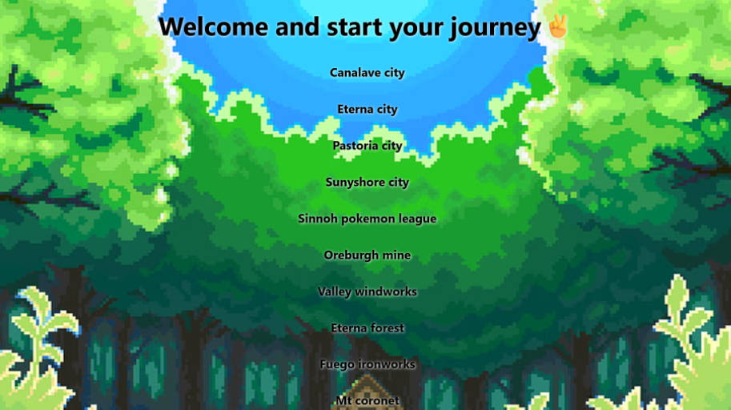
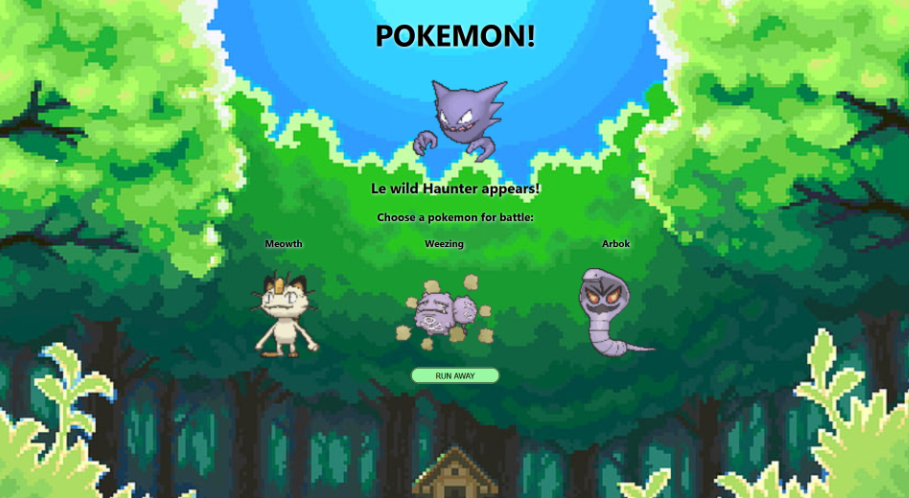
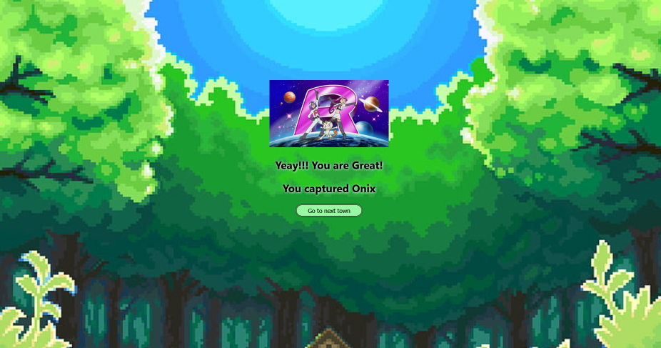
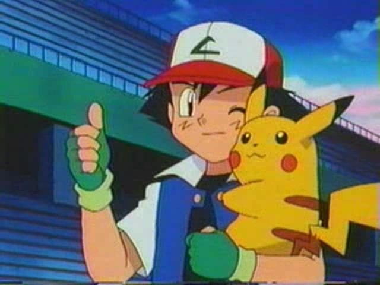

<!-- PROJECT LOGO -->
<div align="center">
  <h1 align="center">Gotta Fetch 'Em All</h1>
</div>

<!-- TABLE OF CONTENTS -->
<details>
  <summary>Table of Contents</summary>
  <ol>
    <li>
      <a href="#about-the-project">About The Project</a>
      <ul>
        <li><a href="#built-with">Built With</a></li>
      </ul>
    </li>
    <li>
      <a href="#getting-started">Getting Started</a>
      <ul>
        <li><a href="#prerequisites">Prerequisites</a></li>
        <li><a href="#installation">Installation</a></li>
      </ul>
    </li>
    <li>
      <a href="#running-the-app">Running the App</a>
      <ul>
        <li><a href="#with-npm">With NPM</a></li>
      </ul>
    </li>
    <li><a href="#features">Features</a></li>
    <li><a href="#roadmap">Roadmap</a></li>
  </ol>
</details>

<!-- ABOUT THE PROJECT -->
## About The Project

Welcome to **Gotta fetch() 'Em All**, an immersive Pokémon-themed project using React. Using the [PokéApi](https://pokeapi.co/), this app allows users to explore real Pokémon locations, battle creatures and catch them.

<p align="center"> 
 


</p>

<br>

### Built With
[![JavaScript][JavaScript-url]](https://www.javascript.com/)
[![React][React-url]](https://react.dev/)
[![HTML5][HTML5-url]](https://html.com/)
[![CSS3][CSS3-url]](https://css.com/)

<!-- GETTING STARTED -->
## Getting Started

Follow these steps to set up the project locally.

### Prerequisites

Ensure you have the following installed:

* npm (for local setup)

### Installation

1. Clone the repository:
```sh
  git clone https://github.com/your-repo-url
```

<!-- RUNNING THE APP -->
## Running the App

1. Navigate to the project root folder:
```sh
  cd your-project-folder
```
2. Then navigate to the pokemon-react folder:
```sh
  cd /pokemon-react
```
### With NPM
1. Install dependencies:
```sh
  npm install
```
2. Start the application:
```sh
  npm start
```
3. Access the app at [http://localhost:3000][localhost-3000]

4. Stop the application:
```sh
  Ctrl + C
```

<!-- FEATURES -->
## Features
- Pokémon encounters based on location
- Real-time battle mechanics
- Store and display captured Pokémon.
- Responsive UI with React

<!-- ROADMAP -->
## Roadmap

- [x] Fetch Pokémon data from PokéAPI
- [x] Implement battle mechanics
- [x] Add Pokédex display
- [ ] Gym battles and earn Gym Badges
- [ ] Enable user progress saving
- [ ] Deploy publicly

<br>
<h3>Let's start a new journey!</h3>


<!-- MARKDOWN LINKS & IMAGES -->
[PokéApi-url]: https://pokeapi.co/
[React-url]: https://img.shields.io/badge/React-61DAFB?style=for-the-badge&logo=react&logoColor=black
[JavaScript-url]: https://img.shields.io/badge/JavaScript-F7DF1E?style=for-the-badge&logo=javascript&logoColor=black
[HTML5-url]: https://img.shields.io/badge/HTML5-E34F26?style=for-the-badge&logo=html5&logoColor=white
[CSS3-url]: https://img.shields.io/badge/CSS3-1572B6?style=for-the-badge&logo=css3&logoColor=white
[Docker-url]: https://img.shields.io/badge/docker-%230db7ed.svg?style=for-the-badge&logo=docker&logoColor=white
[Nginx-url]: https://img.shields.io/badge/nginx-%23009639.svg?style=for-the-badge&logo=nginx&logoColor=white
[localhost-3000]: http://localhost:3000

